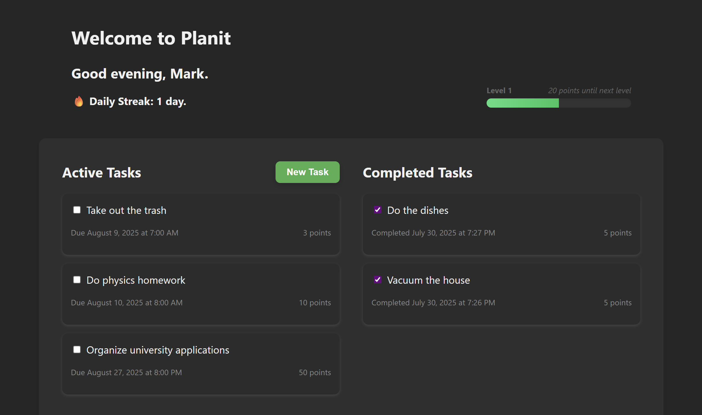

# Planit

Manage your day and boost your productivity with Planit! 

Planit is a to-do list app where you can keep track of and prioritize your day-to-day tasks with ease. Create, update and delete tasks, and complete them to earn experience points and gain levels! With a clean and intuitive interface, you can get things done in no time with Planit. 

## License

This project is licensed under the [MIT](LICENSE) license.